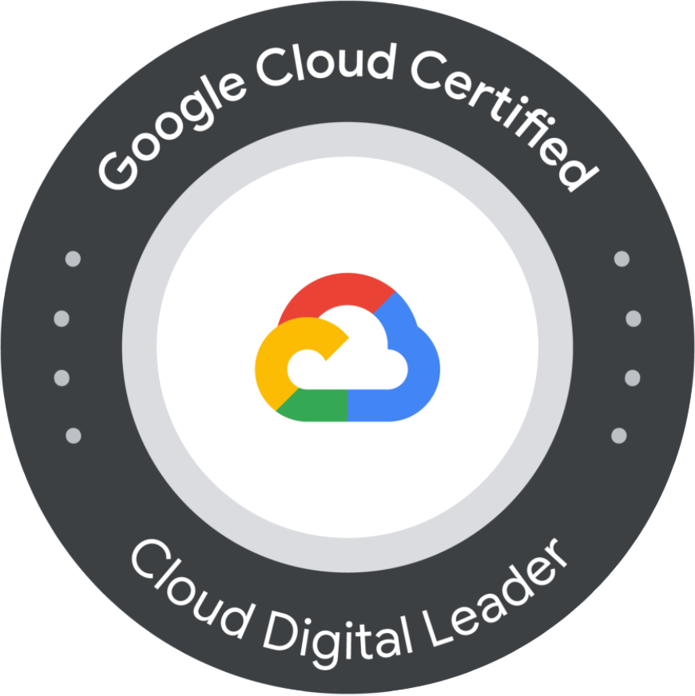
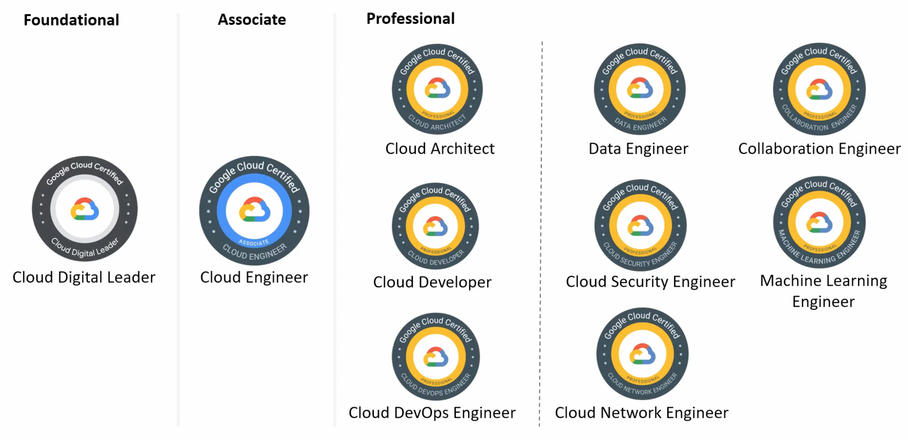

# Preparing the Google Cloud Digital Leader Certification

<div align="center">
  

  [](https://cloud.google.com/certification/cloud-digital-leader)
  [](https://cloud.google.com/blog/topics/training-certifications/google-cloud-cloud-digital-leader-certification-and-training)
</div>

  > Somebody once told me: keep learning no matter what :) 

  > I was studying for the Google Cloud Digital Leader Exam. Here is my study path that I designed and followed to pass the exam :)


## Recommendations
```
Some recommendations that worked for me:
  - I took notes of acronyms meaning and names of services. In most cases, these names have a relation with the objective of the service. So using my background and logic I solved some questions!
  - I took notes of little details that I considered important or hard to remember. In this way, when I was learning, I could go back and I had a chance to remember the notes with just a quick look.
  - I read the requirements, rules, times, numbers of questions related to the exam! I didn't want to lose the exam for not being on time.
  - I completed the courses available in Coursera. See the links below:
    -- Introduction to Digital Transformation with Google Cloud
    -- Innovating with Data and Google Cloud
    -- Application and infrastructure modernization with Google Cloud
    -- Understanding Google Cloud Security and Operations
    -- Google Cloud Practitioner Essentials. 
  - I tried some Google Cloud practitioner sample questions.
  - I read about identity, networking, pricing model, conditions of service support.
  - I tried the simulation tests in [Whizlabs] y [Pluralsight]. They are paid, but free trial versions work well.
  - I attended the online exam, so I chose my home with the supervision of a remote person.
  - Finally, I tried to sleep well the previous day and after the exam and I enjoyed a ice cream when I receive the results!
  If you don't pass the exam, there is always a solution. Although you have to pay again, it is not game over!

 Consider following this roadmap and mark each step when you finish!
```

## Roadmap
  - [ ] [Cloud Glossary](#glossary)
  - [ ] [Cloud Concepts](#step-2-cloud-concepts)
  - [ ] [Google Cloud Concepts](#step-3-gc-concepts)    
  - [ ] [Google Cloud Products](#step-4-gc-products)
  - [ ] [Google Cloud Training](#step-5-gc-training-courses)
  - [ ] [Google Cloud Certification](#step-6-gc-certification)
  - [ ] [Google Cloud Sample Questions](#step-7-gc-sample-questions)
  - [ ] [Google Cloud Labs More Resources](#step-8-gc-labs-more-resources)


## [Step 2 Cloud Concepts](https://cloud.google.com/compute/docs/concepts)
  - [Cloud Computing](files/1_cloud_summary.pdf)
  - [Cloud Types](files/2_cloud_types.pdf)
  - [Cloud Models](files/3_cloud_models.pdf)


## [Step 3 GC Concepts](https://cloud.google.com/)
  - [Google Cloud Adoption Framework](https://services.google.com/fh/files/misc/google_cloud_adoption_framework_whitepaper.pdf)
  - [Google Cloud Maturity Assessment](https://digitalmaturitybenchmark.withgoogle.com/cloud/)


## [Step 4 GC Products](https://cloud.google.com/products)
  - [Google Cloud Products](#gc-products)


## [Step 5 GC Training Courses](https://cloud.google.com/training/business?skip_cache=true#cloud-digital-leader-path)
- [Coursera Specialization](https://www.coursera.org/professional-certificates/google-cloud-digital-leader-training)
- [Pluralsight Courses](https://app.pluralsight.com/paths/skills/google-cloud-digital-leader-training)


## [Step 6 GC Certification](https://cloud.google.com/certification/cloud-digital-leader)
- [Exam Schedule](https://www.kryteriononline.com/locate-test-center)
- [Exam Instructions](https://www.youtube.com/watch?v=8bc3jd9Z5Rw)
- [Exam Guide](https://cloud.google.com/certification/guides/cloud-digital-leader)


## Step 7 GC Sample Questions
- [Sample Questions 1](https://docs.google.com/forms/d/e/1FAIpQLSfsSfkh9PE-HjdRRzJ24wPSjZrXF3gLxmncAYx31gyz2rLbtw/viewform?fbzx=-1538860675896131993)


## Step 8 GC Labs More Resources
- [GC Training 2021 Full Course](https://www.youtube.com/watch?v=UGRDM86MBIQ)
- [Hifce's Journey Story](https://hey.hifce.com/2021/05/03/a-quick-review-of-the-new-cloud-digital-leader-beta-exam/)


## Glossary
| Term    	                        | GC Service       | Meaning               			                                |
|:---------------------------------:|:-----------------:|:-----------------------------------------------------------------:|
| Zones            				    | Zones   			| Locations (zones within regions) where resources are housed.		|
| API Endpoints    			        | Cloud Endpoints   | Single entryway that allows multiple APIs to act cohesively. 		|
| Autoscaling          				| Engine Autoscaler | Scales resources (of a group) up or down based on usage and rules.|
| CDN - Content Delivery Network	| Cloud CDN         | Global network that delivers content based on locations of users.	|
| Compute              				| Compute Engine    | Scalable compute instances (servers).   							|
| Data Warehouse					| BigQuery  		| Central repositories of integrated data.							|
| DNS - Domain Name System 			| Cloud DNS  		| Naming database where domain names are translated into IPs.		|
| IAM - Identity Access Management 	| Cloud IAM   		| Manage access to cloud services and resources securely.			|
| LB - Load Balancing 				| Load Balancing 	| Pushes traffic across multiple targets in multiple AZs.			|
| MD SP Service   					| Dataflow 			| Managed Data Stream Processing Service.							|
| MK K8s Service 					| Kubernetes (GKE)	| Managed Kubernetes (K8s) Service to run K8s clusters.				|
| MNoSQL DB Service 			    | Cloud Bigtable 	| Distributed non-relational database service.						|
| MSQL DB Engine   					| Cloud Spanner		| Managed SQL Database Engine.										|
| MSQL DB Service 					| Cloud SQL  		| Managed SQL Database Service running multiple SQL engines.		|
| Messaging Queue Service 			| Cloud Pub/Sub  	| Message queuing service to decouple and scale distributed systems.|
| NAT - Network Address Translation | Cloud NAT 		| Outbound internet traffic from instances in a private subnet.		|
| Network Peering  					| VPC Net Peering	| Networking connection between two VPCs for routing traffic.		|
| Network Routes/Routing 			| Cloud Routes 		| Set of rules to determine where network traffic is directed.		|
| Object Storage 					| Cloud Storage  	| Scalable, highly available storage for objects.					|
| Pub/Sub Messaging 				| Cloud Pub/Sub  	| Pub/sub messaging service to decouple distributed systems.		|
| Region 							| Cloud Region  	| Worldwide locations where resources are hosted.					|
| Security Groups 					| Firewall Rules  	| List of security rules that allow or deny network traffic.		|
| Serverless Container Service  	| Cloud Run (+GKE) 	| Run containers without managing servers.							|
| Serverless Functions  			| Cloud Functions 	| Event-driven service that runs code in response to events.		|
| Subnet 							| Cloud Subnet  	| Logical subdivision of an IP network. Can be private or public.	|
| Third Party or Guest Access 		| Cloud IAM  		| Grant access to resources to another cloud account.				|
| Virtual Private Cloud (VPC) 		| Cloud VPC  		| Logically isolated section of cloud where resources are launched.	|
| VPN Gateway  						| Cloud VPN 		| Private connection to VPCs.										|


## GC Products
| Category    	        | GC Product                                      | Category    	     | GC Product           | 
|:---------------------:|:-----------------------------------------------:|----------------------|----------------------|
| AI - Machine Learning | [Vertex AI](https://cloud.google.com/vertex-ai) |API Management        | [Apigee API Management](https://cloud.google.com/apigee) |
| | [DialogFlow](https://cloud.google.com/dialogflow) | | [Cloud Endpoints](https://cloud.google.com/endpoints) |
| | [AutoML](https://cloud.google.com/automl) |  | [Apigee Hybrid](https://cloud.google.com/apigee/api-management/hybrid) |
| | [Vision AI](https://cloud.google.com/vision)  | | [Apigee Sense](https://cloud.google.com/apigee/sense) |
| | [Video AI](https://cloud.google.com/video-intelligence) |  | [Apisheet Automation](https://cloud.google.com/appsheet) |
| | [Recommendations AI](https://cloud.google.com/recommendations)  | | [Apisheet Automation](https://cloud.google.com/appsheet/automation) |
| | [Text to Speech](https://cloud.google.com/text-to-speech) |  | [Cloud Healthcare API](https://cloud.google.com/healthcare)  |
| | [Speech to Text](https://cloud.google.com/speech-to-text) |  |  |
| | [Cloud Natural Language](https://cloud.google.com/natural-language) |  |  |
| | [Deep Learning VM](https://cloud.google.com/deep-learning-vm/) |  |  |
| | [Deep Learning Containers](https://cloud.google.com/deep-learning-containers) |  |  |
| | [Notebooks](https://cloud.google.com/notebooks) |  |  |
| | [Vertex Data Labeling](https://cloud.google.com/vertex-ai/docs/datasets/data-labeling-job) |  |  |
| | [TensorFlow Enterprise](https://cloud.google.com/tensorflow-enterprise) |  |  |
| | [Cloud Traslation]()  | |  |  |
| | [Media Traslation]()  |  |  |
| Compute | [App Engine](https://cloud.google.com/appengine) | Containers        | [Google Kubernetes Engine](https://cloud.google.com/kubernetes-engine) |
| | [Bare Metal](https://cloud.google.com)  |  |  [Container Registry](https://cloud.google.com/container-registry) |
| | [Cloud GPUs](https://cloud.google.com)  |  |  [Container Security](https://cloud.google.com/container-security)  |
| | [Cloud Run](https://cloud.google.com)  |  |  [Cloud Build](https://cloud.google.com/cloud-build/cloud-build) |
| | [Compute Engine](https://cloud.google.com)  |  |  [Deep Learning Containers](https://cloud.google.com/deep-learning-containers) |
| | [Migrate for Compute Engine](https://cloud.google.com)  |  |  [Kubernetes Applications](https://cloud.google.com/kubernetes-applications) |
| | [Preemtible VMs](https://cloud.google.com)  |  |  [Knative](https://cloud.google.com/knative) |
| | [Shielded VMs]()  |  |  [Artifact Registry](https://cloud.google.com/artifact-registry) |
| | [Sole-tenant Nodes]()  |  |  [Cloud Run](https://cloud.google.com//cloud-run) |
| | [Bare Metal]()  |  |  [Cloud Code](https://cloud.google.com/cloud-code) |
| | [Recommender]()  |  | |
| | [VMware Engine]()  |  | |
| | [Cloud Run]()  |  | |
| | [Recommender]()  |  | |
| Databases | [Cloud Bigtable](https://cloud.google.com/cloud-bigtable) | Data Analytics        | [BigQuery](https://cloud.google.com/kubernetes-engine) |
| | [Firestore](https://cloud.google.com/firestore)  |  |  [Looker](https://cloud.google.com/looker) |
| | [Memory Store](https://cloud.google.com/memory-store)  |  |  [Dataflow](https://cloud.google.com/dataflow)  |
| | [Cloud Spanner](https://cloud.google.com/cloud-spanner)  |  |  [Pub/Sub](https://cloud.google.com/cloud-build/pubsub) |
| | [Cloud SQL](https://cloud.google.com/cloud-sql)  |  |  [Dataproc](https://cloud.google.com/dataproc) |
| | [Database Migration Service](https://cloud.google.com/database-migration-service)  |  |  [Cloud Data Fusion](https://cloud.google.com/data-fusion) |
| | [Bare Metal Solution for Oracle](https://cloud.google.com/bare-metal)  |  |  [Cloud Composer](https://cloud.google.com/cloud-composer) |
| | [Firebase Realtime Database](https://cloud.google.com)  |  |  [Dataprep](https://cloud.google.com/dataprep) |
| | [Datastream](https://cloud.google.com/datastream)  |  |  [Dataplex](https://cloud.google.com/dataplex) |
| Networking  | [Cloud Armor](https://cloud.google.com/armor) | Storage | In progress ...  |
| | [Clou CDN](https://cloud.google.com/cdn)  |  | |
| | [Cloud Domains](https://cloud.google.com/domains)  |  | |
| | [Cloud DNS](https://cloud.google.com/dns)  |  | |
| | [Cloud Load Balancing](https://cloud.google.com/load-balancing)  |  | |
| | [Cloud NAT](https://cloud.google.com/nat)  |  | |
| | [Network Telemetry](https://cloud.google.com/cdn)  |  | |
| | [Hybrid Connectivity](https://cloud.google.com/network-telemetry)  |  | |
| Security | In progress ... | Operations | In progress ...  |


That's all folks! :smile:

<div align="center">
    
</div>

-----------
## Contributing
See [CONTRIBUTING.md](CONTRIBUTING.md)
